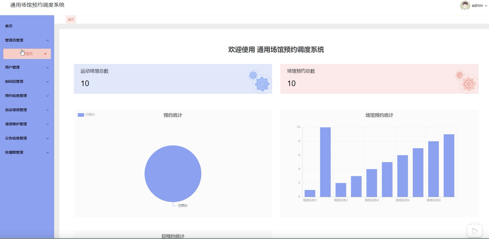
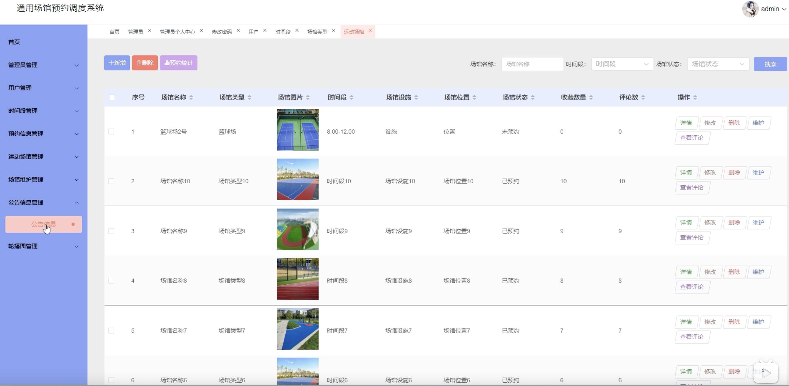
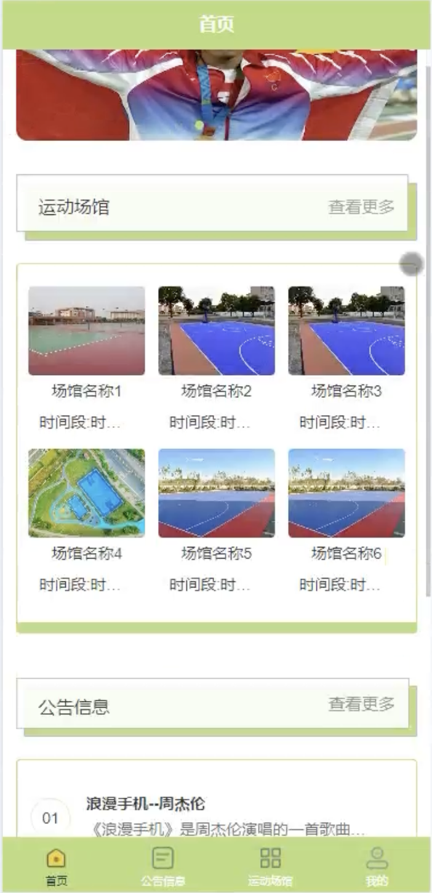
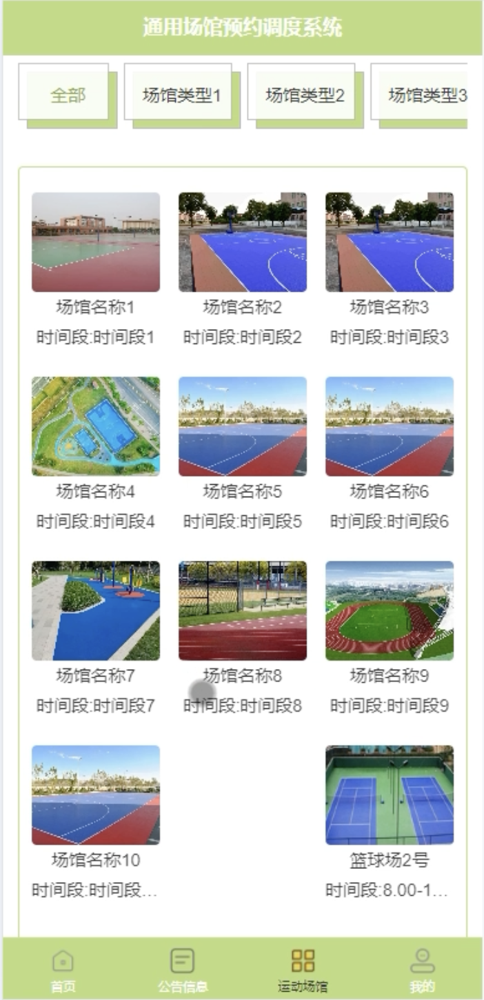
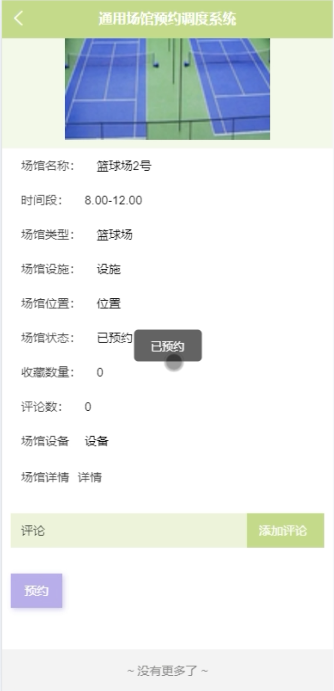
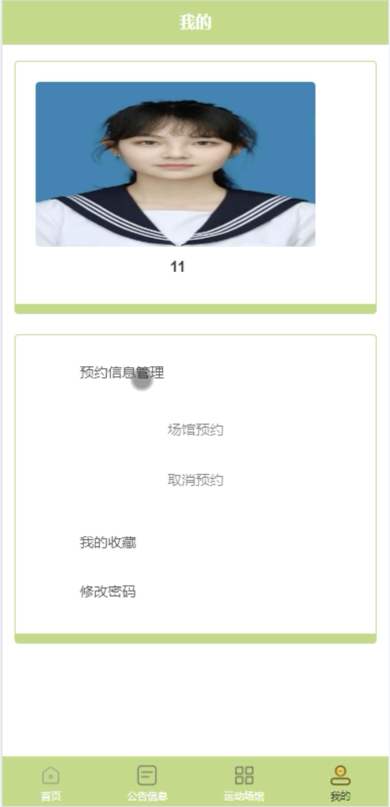
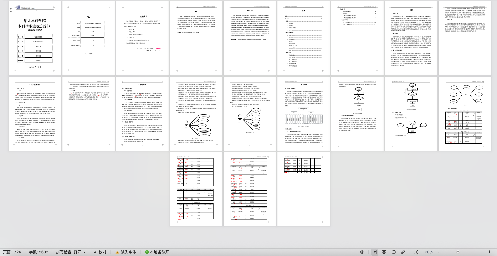

# mpweixinA242D
mpweixinA242D通用场馆预约调度微信小程序+LW+PPT
 
## 源码问题查看主页咨询

### 一、关键词
场馆预约系统、运动场馆管理系统、体育场馆预约系统、健身场馆预约、场地预约系统

### 二、作品包含
源码+数据库+设计文档+PPT+全套环境和工具资源+本地部署教程

### 三、项目技术
前端技术： Html、Css、Js、Vue3.2、Element-Plus、uniapp
后端技术：Java、SpringBoot3.3.0、MyBatis-Plus

### 四、运行环境（以下版本亲测，其他版本兼容性请自行测试）
开发工具：IDEA/eclipse + VSCODE + HBuilder X + 微信开发者工具

数据库：MySQL 8.0+

数据库管理工具：Navicat10以上版本

环境配置软件： JDK17 + Maven3.6+

前端Nodejs：16+

浏览器：谷歌浏览器

### 五、项目介绍
项目编号：mpweixinA242D

基于微信小程序的通用场馆预约调度系统，方便用户快速预约各类场馆资源，实现场馆的智能化调度管理，提升场馆使用效率。

角色：管理员、用户

用户功能：注册登录、浏览场馆、场馆预约、预约记录、余额充值、场馆收藏、个人中心。

管理员功能：用户管理、场馆管理、场馆类型管理、场馆预约管理、场馆维护管理、充值信息管理、场馆评论管理、系统管理。

数据库表：15张

### 六、运行截图

